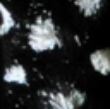
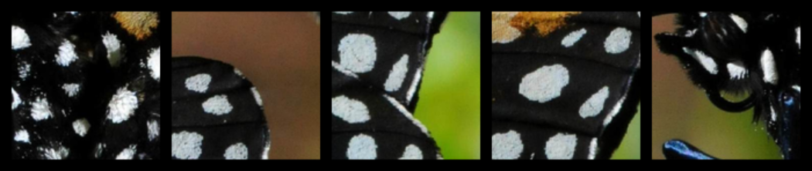

# Simple Content Based Image Retrieval
This repository contains a Jupyter notebook which implements a simple CBIR system with an in-memory database in form of a dictionary.

## Problem Definition
The main idea and methodology for approaching the problem in this particular example are taken from [Investigating the Vision Transformer Model for Image Retrieval Tasks [1]](https://arxiv.org/abs/2101.03771).

## Model and Query 
Image similarity is based on feature vectors extracted from images using a **Vision Transformer (ViT)** defined in [An Image is Worth 16x16 Words: Transformers for Image Recognition at Scale [2]](https://arxiv.org/abs/2010.11929). The pretrained model is acquired using the [pytorch-image-models library [3]](https://github.com/huggingface/pytorch-image-models).

## Showcase
The examples shown here are based on [DIV2K [4]](https://data.vision.ee.ethz.ch/cvl/DIV2K/) train imageset image 0006 featuring a monarch butterfly.

Query:

Result:

Query:

Result:

## References
<a id="1">[1]</a> 
Investigating the Vision Transformer Model for Image Retrieval Tasks; 
Socratis Gkelios and Yiannis Boutalis and Savvas A. Chatzichristofis;
2021;
2101.03771;
arXiv

<a id="2">[2]</a> 
An Image is Worth 16x16 Words: Transformers for Image Recognition at Scale;
Alexey Dosovitskiy and Lucas Beyer and Alexander Kolesnikov and Dirk Weissenborn and Xiaohua Zhai and Thomas Unterthiner and Mostafa Dehghani and Matthias Minderer and Georg Heigold and Sylvain Gelly and Jakob Uszkoreit and Neil Houlsby;
2021;
2010.11929;
arXiv

<a id="3">[3]</a> 
Ross Wightman;
PyTorch Image Models;
2019;
GitHub;
GitHub repository;
10.5281/zenodo.4414861

<a id="4">[4]</a> 
Agustsson, Eirikur and Timofte, Radu;
NTIRE 2017 Challenge on Single Image Super-Resolution: Dataset and Study;
The IEEE Conference on Computer Vision and Pattern Recognition (CVPR) Workshops;
July 2017
