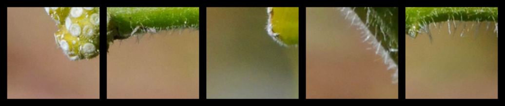

# Simple Content Based Image Retrieval
This repository contains a Jupyter notebook which implements a simple CBIR system. There are two use examples: one with an in-memory database in form of a dictionary and another with a Deeplake DB stored locally in the file system.

## Problem Definition
The purpose of CBIR is to find similar images based on the visual content of the image, modern approaches use deep learning methods for feature extraction. These features are used as image representation in a vector space which has a reduced number of dimension compared to the original image. Similarity between images is calculated as similarity between their feature vectors. One of the commonly used comparison methods is cosine similarity.
The main idea and methodology for approaching the problem in this particular example are taken from [Investigating the Vision Transformer Model for Image Retrieval Tasks [1]](https://arxiv.org/abs/2101.03771).

## Model and Query 
Image similarity is based on feature vectors extracted from images using a **Vision Transformer (ViT)** defined in [An Image is Worth 16x16 Words: Transformers for Image Recognition at Scale [2]](https://arxiv.org/abs/2010.11929). The pretrained model is acquired using the [pytorch-image-models library (timm) [3]](https://github.com/huggingface/pytorch-image-models). The softmax layer is removed and the 768 dimensional feature vector is set as the new model output. [Deeplake [5]](https://github.com/activeloopai/deeplake) is used as a vector database solution.

## Showcase
The examples shown here are based on [DIV2K [4]](https://data.vision.ee.ethz.ch/cvl/DIV2K/) train imageset image 0006 featuring a monarch butterfly. The query return size was set to 5.

Query:

Result:

Query:

Result:

## References
<a id="1">[1]</a> 
Investigating the Vision Transformer Model for Image Retrieval Tasks; 
Socratis Gkelios and Yiannis Boutalis and Savvas A. Chatzichristofis;
2021;
2101.03771;
arXiv

<a id="2">[2]</a> 
An Image is Worth 16x16 Words: Transformers for Image Recognition at Scale;
Alexey Dosovitskiy and Lucas Beyer and Alexander Kolesnikov and Dirk Weissenborn and Xiaohua Zhai and Thomas Unterthiner and Mostafa Dehghani and Matthias Minderer and Georg Heigold and Sylvain Gelly and Jakob Uszkoreit and Neil Houlsby;
2021;
2010.11929;
arXiv

<a id="3">[3]</a> 
Ross Wightman;
PyTorch Image Models;
2019;
GitHub;
GitHub repository;
10.5281/zenodo.4414861

<a id="4">[4]</a> 
Agustsson, Eirikur and Timofte, Radu;
NTIRE 2017 Challenge on Single Image Super-Resolution: Dataset and Study;
The IEEE Conference on Computer Vision and Pattern Recognition (CVPR) Workshops;
July 2017

<a id="5">[5]</a> 
Deep Lake: a Lakehouse for Deep Learning;
Hambardzumyan, Sasun and Tuli, Abhinav and Ghukasyan, Levon and Rahman, Fariz and Topchyan, Hrant and Isayan, David and Harutyunyan, Mikayel and Hakobyan, Tatevik and Stranic, Ivo and Buniatyan, Davit;
https://www.cidrdb.org/cidr2023/papers/p69-buniatyan.pdf;
Proceedings of CIDR;
2023;
https://github.com/activeloopai/deeplake